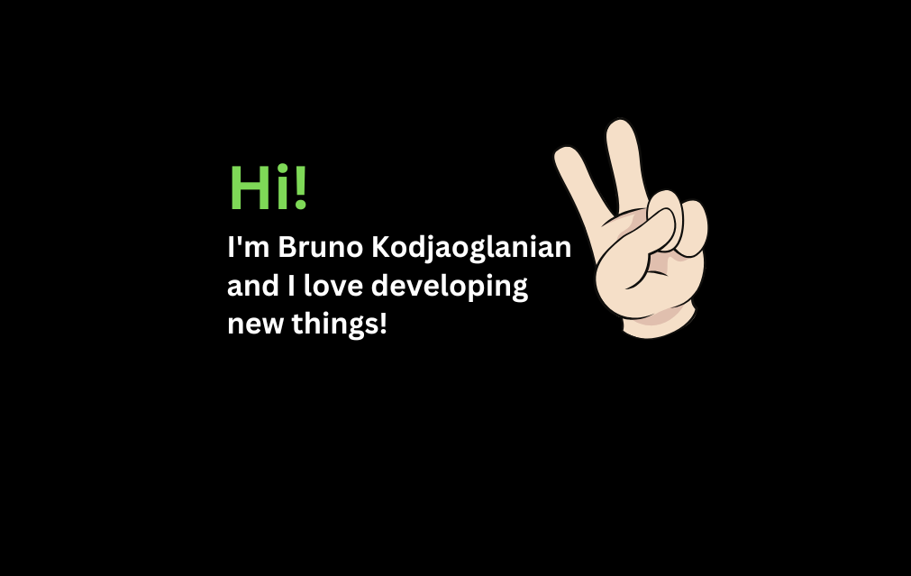

### Hi! 👋 I'm Bruno Kodjaoglanian

#### Software Engineer & AI Solution Architect

I turn complex problems into systems that actually work. I don't write code for the sake of it — I build tools that solve real pain: automation that eliminates manual work, AI that extracts value from silent data, and platforms that connect dots no one else saw.

My track record spans critical infrastructure (firewall automation, moderation proxies), applied intelligence (RAG, LLM fine-tuning, anomaly detection with State Space Models) and full products built from scratch — backend, frontend, mobile and desktop. I know the whole stack, but my edge is systems thinking: understand the problem before picking the tool.

I'm driven by hard technical challenges and by shipping code others can read, maintain and evolve. I believe the best architecture is the one that solves today without trapping you tomorrow.

---

### 🖥️ Backend & APIs

---

### 🤖 AI & Machine Learning

---

### 🗄️ Databases, Search & Storage

---

### 🌐 Frontend & Mobile

---

### 🖥️ Desktop & GUI

---

### 🧪 Automation, Web Scraping & Documents

---

### 🐳 DevOps, Infrastructure & Cloud

---

### 🛠️ Tools & Utilities

---

### 📊 Languages & Activity

  

 

<picture>
  <source media="(prefers-color-scheme: dark)" srcset="https://raw.githubusercontent.com/kodjaoglanian/kodjaoglanian/output/github-contribution-grid-snake-dark.svg">
  <source media="(prefers-color-scheme: light)" srcset="https://raw.githubusercontent.com/kodjaoglanian/kodjaoglanian/output/github-contribution-grid-snake.svg">
  
</picture>

---

🚀 Always learning, always building.

📫 **Get in touch:**
- 🖥️ Links & projects: [My Links](https://portfolio.kodjao.com)
